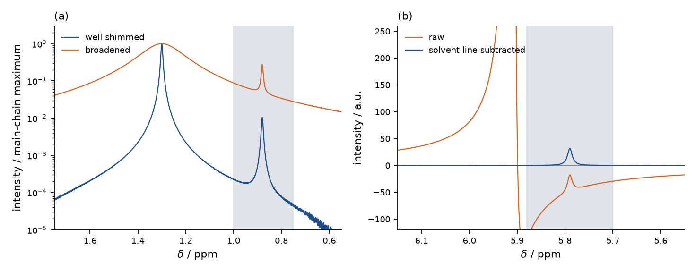

# polyolefin-endgroup-nmr

[](https://github.com/Brown-cell/polyolefin-endgroup-nmr/actions/workflows/tests.yml)

A polyethylene chain is a long run of CH₂ with something different at each end,
and ¹H NMR can count those ends against the backbone to give a chain length and
Mₙ with no calibration curve. Two things make it awkward: the backbone line is
three or four orders of magnitude taller than the signals you want, and the
residual solvent line often sits on an end-group window. This package integrates
the windows, gates spectra too poorly shimmed for the CH₃ number to survive,
subtracts the solvent line, and reports ends per chain and Mₙ.



(a) the CH₃ window (shaded) beside the main-chain CH₂ line, each trace
normalised to its own maximum. (b) the vinyl –CH= window before and after the
5.91 ppm solvent line is subtracted. Redraw with `examples/plot_demo.py`.

Raw data is read with [nmrglue](https://www.nmrglue.com/): Bruker/TopSpin
dataset directories natively, JEOL through a JCAMP-DX export.

```
pip install -r requirements.txt
python examples/synthetic_demo.py          # synthetic spectrum, no data needed
python -m endgroup_nmr.cli --regions regions.example.json /path/to/data
```

## Windows and arithmetic

The windows are the textbook assignments. They live in `regions.example.json`
and there is no hard-coded ppm anywhere in `endgroup_nmr/`:

| window | ppm | what it reports |
|---|---|---|
| main-chain CH₂ | 1.10–1.45 | the `(CH₂)ₙ` envelope; the intensity reference |
| CH₃ | 0.75–1.00 | saturated ends (and short-chain branches) |
| vinylidene =CH₂ | 4.60–4.80 | 1,1-disubstituted olefin end |
| vinyl =CH₂ | 4.90–5.00 | terminal vinyl, two protons |
| vinyl –CH= | 5.70–5.88 | the same vinyl end, one proton |
| internal –CH=CH– | 5.30–5.50 | in-chain unsaturation, not an end |

From the integrals:

```
amount(group)  = integral / protons_per_group
chains         = sum of amount over the chain-counting groups
ends_per_chain = sum of amount over the chain-end groups / chains
Mn             = repeat_unit_mass * (carbons per chain) + end_group_mass
```

`ends_per_chain` needs a count of chains and no spectrum gives you one free, so
you assume something. The shipped default is the textbook assumption for a
chain terminated by β-hydride elimination: **exactly one unsaturated terminus
per chain**. A perfectly linear chain then reads 2.0, and the departure from 2.0
is the finding. Change `chain_count_groups` if your chemistry counts chains
differently; the number means nothing without the assumption behind it.

## Spectrum reversal

`nmrglue.proc_base.fft` orders its output by increasing frequency index and
Bruker digitises with the opposite sense, so the transform comes out mirrored:
the aromatic end lands where the aliphatic end belongs. `proc_base.rev` puts it
back, and `processing.fourier_transform` always calls it. A mirrored polyolefin
spectrum still looks plausible, one enormous aliphatic line with small
satellites, and no error is raised while every integral comes from the wrong
place. Check where the solvent line lands before believing anything else.

The rest is the standard recipe: remove the Bruker digital filter (the
`grpdly` group delay, which otherwise wrecks the baseline), zero-fill, FFT,
reverse, ACME automatic phasing, discard the imaginary channel, polynomial
baseline, calibrate the axis on a line of known shift.

## The valley_ratio shim gate

A Lorentzian has heavy tails and a badly shimmed line heavier ones, so the foot
of the main-chain peak spills into the CH₃ window and is integrated as chain
ends. The spectrum looks fine and the number is inflated.

```
valley_ratio = (lowest point between the CH₃ maximum and the main-chain maximum)
               / (main-chain maximum)
```

On a well-shimmed spectrum the peaks come down to the noise between them and
the ratio is tiny; as the line broadens the trough lifts off the baseline and
the ratio grows (panel (a) above). Rejecting spectra above a threshold discards
the ones whose CH₃ integral is contaminated, a failure no later arithmetic can
undo.

The threshold is empirical and belongs in the regions file: it depends on field,
temperature, solvent and how much CH₃ you expect. Measure several spectra you
trust and several you know are bad, then put the number where it separates
them. It does not certify the CH₃ window as unbiased (see
[Limitations](#limitations)), only separate a statable bias from one that
swamps the measurement.

## Solvent-line subtraction

The residual solvent line is enormous and its tail leaks into the neighbouring
window. The leak is partly dispersive (a phasing artefact, negative on one side
of the line), so naive integration can come out negative: in the demo the raw
–CH= window integrates to about −26 per 1000 main-chain protons, and to +1.49
after subtraction, against a true value of 1.50.

`solvent_fit` fits a phase-mixed Lorentzian, `cos(φ)·absorption +
sin(φ)·dispersion` plus a local linear baseline, and subtracts the line shape.
The fit windows are declared in the regions file and must **exclude** the
window being protected:

```json
{
  "applies_to": "vinyl_CH",
  "center_bounds": [5.85, 6.00],
  "fit_windows": [[5.90, 6.40], [5.55, 5.68]],
  "max_hwhm_ppm": 0.2
}
```

Fit across the window and the model absorbs the signal and reports nothing
there. Only the line shape is subtracted; the fitted local baseline would tilt
the rest of the spectrum if extrapolated.

## The regions file

Copy `regions.example.json` and edit it. A region declares its window, the
`group` it reports on, how many protons of that group fall inside the window,
optionally how many carbons the group contributes to the chain (for Mₙ), and a
`role`: `backbone` (the intensity reference), `chain_end` (counted in
`ends_per_chain`) or `in_chain` (counted in Mₙ but not as an end).

One group may be declared through several windows. The vinyl end appears as
both `vinyl_CH` (1H) and `vinyl_CH2` (2H); both should report the same molar
amount, and the code takes the median, so one window spoiled by an overlap does
not drag the answer.

`reference.ppm` calibrates the axis on your residual solvent line: 5.91 for
1,1,2,2-tetrachloroethane-d₂ (the usual choice for polyolefins, which need heat
to dissolve), 7.26 for CDCl₃, 5.32 for CD₂Cl₂, 7.16 for C₆D₆. `null` keeps the
spectrometer's own referencing.

## Real datasets

A Bruker dataset is a directory holding `acqus` plus `fid` (1D) or `ser` (nD),
and a day's folder usually contains numbered sub-experiments `1/`, `2/`, `3/`.
Point the CLI at any level and it walks down. For JEOL, export to JCAMP-DX from
Delta (*File → Export*) and pass the `.jdx` file:

```
python -m endgroup_nmr.cli --regions my_regions.json /data/2026-09-12 --csv results.csv
python -m endgroup_nmr.cli --regions my_regions.json spectrum.jdx
```

Each row is keyed by the dataset's path relative to the directory you gave.
Spectra that fail the gate are kept with `qc_passed = NO`, because seeing the
number you are rejecting beats a blank; `--drop-failed-qc` omits them.

The binary `.jdf` container is not parsed: the free parsers for it are
GPL-licensed and would relicense this MIT package, while nmrglue reads
JCAMP-DX directly. An already Fourier-transformed export is detected from the
file's `DATATYPE` record and skips to baseline correction.

## Library use

```python
from endgroup_nmr import (load_regions, read_any, process, check_valley_ratio,
                          subtract_solvent_lines, quantify)

config = load_regions("regions.example.json")
spectrum = process(read_any(path), reference_ppm=config.reference_ppm)

qc = check_valley_ratio(spectrum, config)
if qc.passed is False:
    raise SystemExit(f"shim quality too poor: valley_ratio={qc.ratio:.4f}")

corrected, fits = subtract_solvent_lines(spectrum, config)
result = quantify(corrected, config)
print(result.ends_per_chain, result.mn, result.notes)
```

`process` returns a `Spectrum` (a ppm array, an intensity array, metadata), so
you can build one from arrays you already have and use the quantification half
alone. That is what `examples/synthetic_demo.py` does: it synthesises a
well-shimmed and a broadened copy from known amounts and compares what comes
back against them.

## Limitations

* The CH₃ window is biased upwards, always. A main-chain line thousands of
  times taller has measurable Lorentzian tail under 0.75–1.00 ppm even when well
  shimmed, and it is integrated as chain ends: in the demo the good case reads
  about 28 % high on CH₃ and 16 % high on ends/chain, while Mₙ and the chain
  length stay within a couple of per cent on the main-chain and unsaturation
  windows. `valley_ratio` measures that leak without removing it; modelling the
  tail and subtracting it, as the solvent line is handled here, would.
* CH₃ is not only chain ends. Short-chain branches land in the same window and
  nothing in a 1D ¹H spectrum separates them.
* Mₙ is a first-order estimate: carbons per chain times the repeat-unit mass,
  from a chain count resting on the assumption you configured. It says nothing
  about the distribution and degrades as chains get longer.
* There is no detection floor. `ends_per_chain` and `Mₙ` return `NaN` only when
  the chain-counting windows integrate to zero or less, so a spectrum holding
  nothing but main-chain tail still returns a large finite `ends_per_chain`.
  Judge that case on `valley_ratio` and on `result.chains`.
* Windows are windows, not assignments. Overlaps with other species are common
  and invisible to the code, so anything nonzero deserves a look at the trace.
* Automatic phasing can fail on a huge dynamic range; plot the trace before
  blaming the arithmetic. 2D datasets are skipped, and Bruker `ser` files are
  found but not handed to the 1D pipeline.

## Requirements

Python 3.10+ with `numpy`, `scipy` and `nmrglue`; `pytest` for the tests.
`examples/plot_demo.py` also needs `matplotlib`, listed separately in
`examples/requirements-plot.txt`.

## License

MIT, see [LICENSE](LICENSE).
